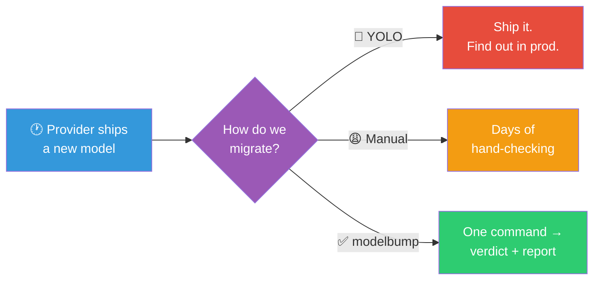
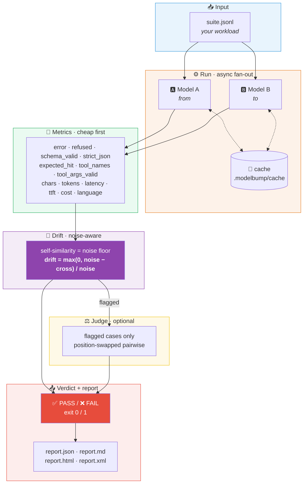
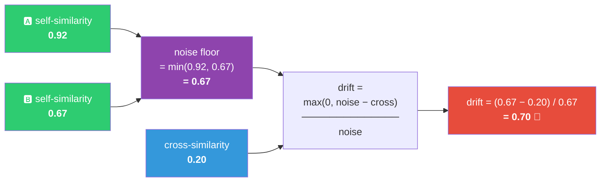
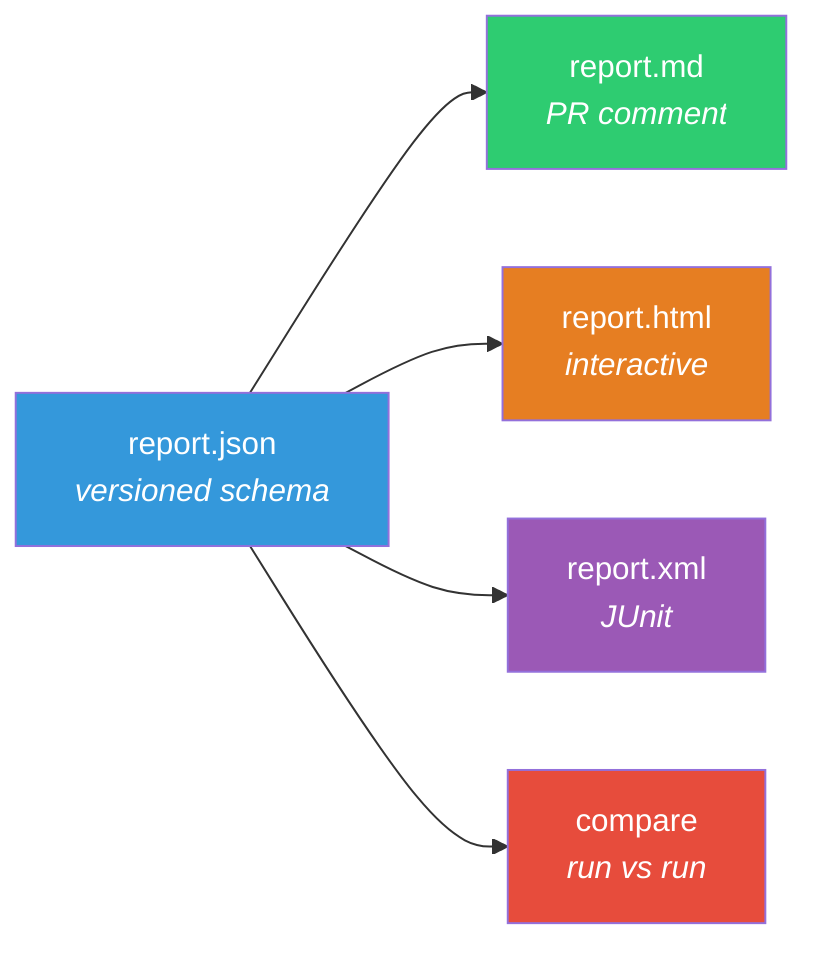
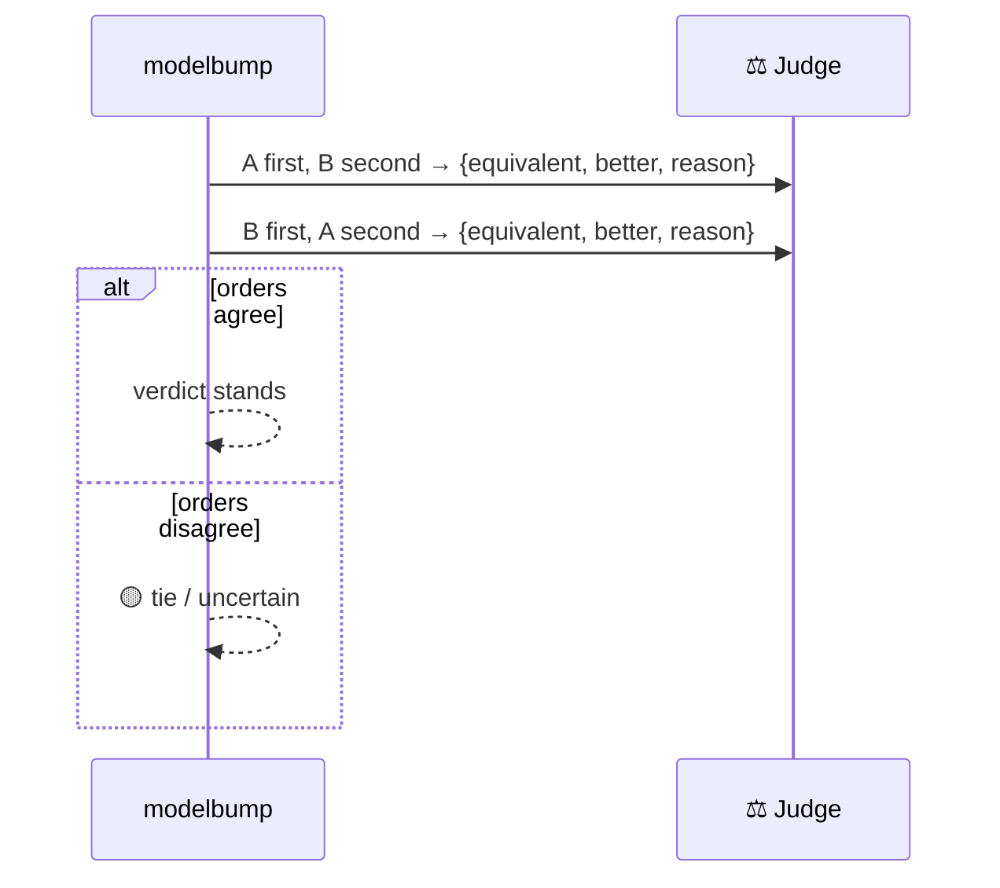
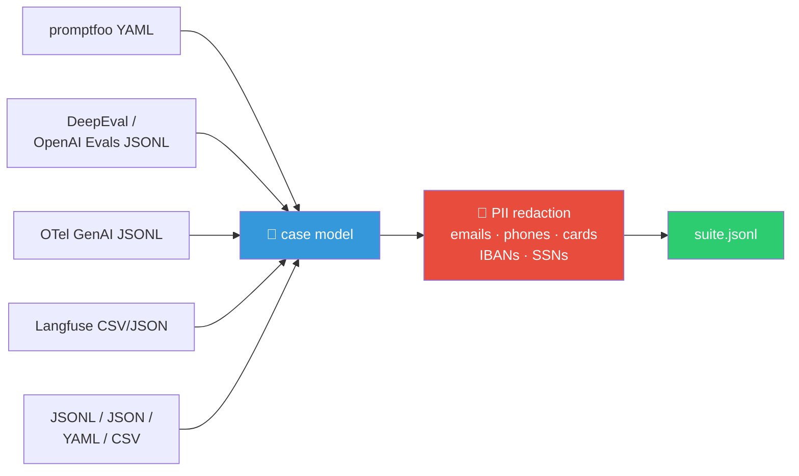

<div align="center">

# 🔀 modelbump

### Behavioral diff for model upgrades and deprecations

**Know exactly what breaks before you change a model string — a behavioral diff of two model versions on your own workload, with a pass/fail you can gate CI on.**

[](https://github.com/iggym/modelbump/actions/workflows/ci.yml)
[](https://pypi.org/project/modelbump/)
[](https://www.python.org/)
[](LICENSE)
[](#-quickstart--fully-offline)
[](#-testing)
[](#-non-goals)

```console
$ modelbump diff --from gpt-4.1 --to gpt-5 --suite suite.jsonl
```

**Not a leaderboard. Not a quality score.** It answers one question:
_did this model switch change behavior on my workload, beyond sampling noise?_

</div>

---

<div align="center">

| 🟢 `stable → stable` | 🔴 `stable → drifty` |
|:---:|:---:|
| **PASS** · 0/18 flagged · drift **0.0%** | **FAIL** · 16/18 flagged · drift **88.9%** |
| `exit 0` | `exit 1` |

</div>

---

## 🎯 The problem



Providers retire models on 6–12-month cycles and ship new ones monthly. Every switch
is a migration with unknown behavioral change: schema conformance, tool selection,
refusals, verbosity, latency, cost.

Existing eval frameworks measure **quality against a rubric**. Nobody measured
**drift between two versions on *your* workload**, with a noise-aware method and a
CI verdict. That is the whole gap `modelbump` fills.

---

## 🚀 Quickstart — fully offline

No API keys. No network. The `mock:` provider is deterministic, so this demo
reproduces byte-for-byte on any machine.

```console
$ pipx install modelbump
$ modelbump init
```

<div align="center">

### 🔴 A model change that breaks

</div>

```console
$ modelbump diff --from mock:stable --to mock:drifty --suite suite.jsonl
```

```text
modelbump  behavioral diff
────────────────────────────────────────────────────────────────────
  mock:stable  →  mock:drifty
  suite: suite.jsonl · 18 cases · 3 samples each

metric       │       A │       B
─────────────┼─────────┼────────
schema-valid │  100.0% │   66.7%
expected-hit │  100.0% │   45.1%
refusal      │   11.1% │   22.2%
error        │    0.0% │    0.0%
avg cost     │ $0.0001 │ $0.0002
p50 latency  │   226ms │   223ms
self-sim     │   0.965 │   0.593

  drifted: 16/18 cases  ( 88.9% drift rate)   mean score 0.57  max 0.97

  flags: length×12  semantic×11  expected×10  refusal×9  schema×2
         strict_json×2  tool_choice×2  expected_tool×1

  by tag:
tag            │ cases │ flagged │  drift
───────────────┼───────┼─────────┼───────
reasoning      │     2 │       2 │ 100.0%   🔴
long-context   │     2 │       2 │ 100.0%   🔴
classification │     2 │       2 │ 100.0%   🔴
summarization  │     2 │       2 │ 100.0%   🔴
multi-turn     │     1 │       1 │ 100.0%   🔴
non-english    │     2 │       2 │ 100.0%   🔴
formatting     │     2 │       2 │ 100.0%   🔴
tool-use       │     2 │       2 │ 100.0%   🔴

────────────────────────────────────────────────────────────────────
   ❌ FAIL   4 violation(s)
    • max_drift_rate: drift rate 88.9% exceeds max 25.0% (16/18 cases flagged)
    • min_schema_valid_rate: model B schema-valid rate 66.7% is below floor 98.0%
    • max_schema_valid_drop: schema-valid rate dropped 33.3% (A 100.0% → B 66.7%), max drop 2.0%
    • max_refusal_increase: refusal rate increased 11.1% (A 11.1% → B 22.2%), max increase 5.0%

reports written:
  out/report.json
  out/report.md
  out/report.html      ← open this one
```

<div align="center">

### 🟢 A model change that is safe

</div>

```console
$ modelbump diff --from mock:stable --to mock:stable --suite suite.jsonl
```

```text
   ✅ PASS   0/18 cases flagged   drift rate 0.0%

  flags: (none)
```

> **Zero drift is an invariant, not a hope.** An identical model has
> `cross_similarity == noise`, so `drift == 0` — tested across every mock variant.

---

## 🧭 How it works



---

## 🌊 What "drift" means here

The naive question is _"did the outputs differ?"_. That is the wrong question,
because a model differs from *itself* every time you sample it.

So `modelbump` measures the **noise floor** first — how similar each model is to
its own samples — and only claims drift when the two models are *more different
than each model is from itself*:



Similarity itself is kind-aware:

| Output kind | Similarity |
|---|---|
| 🗒️ Free text | `0.5 · normalized sequence ratio + 0.5 · token Jaccard` |
| 🧱 JSON | structural: key-set overlap + value-equality ratio |
| 🔧 Tool calls | name equality + argument key/value overlap |

An identical model has `cross_similarity == noise` ⇒ **`drift == 0`**, by construction.

📖 Full derivation and a worked example: [how drift is measured](docs/how-drift-is-measured.md)

---

## 🏁 Flags

Every flag has a documented rule. Nothing is a vibe.

| Flag | 🚩 Fires when |
|---|---|
| `errors` | B errors where A did not |
| `refusal` | refusal rate rose |
| `schema` | schema-valid rate dropped |
| `strict_json` | strict-JSON rate dropped |
| `expected` | A hit the expectation, B did not |
| `expected_tool` | B stopped calling the expected tool |
| `tool_choice` | B chose a different tool |
| `tool_args` | B's tool arguments stopped validating |
| `semantic` | `drift ≥ --drift-threshold` (default `0.35`), free-text only |
| `length` | output length changed > 60% |
| `language` | language switched |
| `latency` | p50 > 2× **and** > +500 ms |
| `truncated` | `finish_reason=length` appears only in B |

---

## 📊 The report



`report.html` is a **single self-contained file** — inline CSS/JS, zero network:

<div align="center">

| Feature | |
|:--|:--|
| 🎛️ Filter by flag / tag | 🔀 Side-by-side outputs |
| 🌗 Light / dark theme | 🔍 Per-sample toggles |
| 📋 Copyable reproduce command | 📱 No external assets |

</div>

Every report embeds the command line, config hash, thresholds, rubric hash, tool
version, cache-hit count, structured-output mechanism per provider, and a
**"how to reproduce"** block. A report is a citation, not a screenshot.

---

## 🧰 Commands

| Command | |
|---|---|
| 🔀 `modelbump diff --from A --to B --suite PATH` | **The main event** — run, diff, report, verdict |
| 🏗️ `modelbump init [dir]` | Scaffold an 18-case example suite + config |
| ✅ `modelbump suite validate PATH` | Schema-check cases, unknown fields, duplicate ids |
| 🧲 `modelbump suite from-traces FILE` | OTel GenAI / Langfuse → cases, **with PII redaction** |
| 📈 `modelbump suite stats PATH` | Tag histogram and coverage |
| 🖨️ `modelbump report DIR` | Re-render from `report.json` |
| ⚖️ `modelbump compare A.json B.json` | Did drift change between runs? |
| 💾 `modelbump cache stats\|clear` | Inspect / clear the response cache |
| 📅 `modelbump calendar` | Upcoming model retirements |
| 🔌 `modelbump providers` | Provider list + masked credential status |
| 🩺 `modelbump doctor` | Check the local setup |

### Model spec grammar

```text
[provider:]model[@base_url]
```

```console
modelbump diff --from gpt-4.1 --to gpt-5 ...
modelbump diff --from anthropic:claude-3-5-sonnet-20241022 --to anthropic:claude-sonnet-4-5 ...
modelbump diff --from azure:my-deploy@https://acme.openai.azure.com --to gpt-5 ...
modelbump diff --from ollama:llama3.1@http://localhost:11434/v1 --to ollama:qwen2.5@... ...
```

---

## 🔌 Providers

All adapters are raw HTTP over `httpx` — **no vendor SDKs**.

<div align="center">

| Provider | Transport | Env var |
|:--|:--|:--|
| 🟩 OpenAI | Chat Completions **and** Responses (auto-selected) | `OPENAI_API_KEY` |
| 🟪 Anthropic | Messages | `ANTHROPIC_API_KEY` |
| 🟦 Google Gemini | `generateContent` | `GEMINI_API_KEY` |
| 🔷 Azure OpenAI | `azure:<deployment>@<endpoint>` | `AZURE_OPENAI_API_KEY` |
| 🟧 AWS Bedrock | Converse (SigV4) | `AWS_ACCESS_KEY_ID` + `AWS_SECRET_ACCESS_KEY` |
| 🟨 OpenAI-compatible | vLLM · Ollama · Groq · Mistral · DeepSeek · OpenRouter · Together · Fireworks | varies |
| ⬜ `mock:` | deterministic, offline | — |

</div>

**Structured output** goes through each provider's native mechanism — OpenAI
`json_schema`, Gemini `responseSchema` (keywords stripped), Anthropic via
tool-forcing — and **the mechanism used is recorded in the report**, because the
mechanism itself is a migration variable.

**Tool definitions** are accepted in OpenAI style and translated per provider;
translation warnings (e.g. unsupported schema keywords) are recorded.

### 🎭 The `mock:` variants

Deterministic, offline, used by the docs, the tests, and CI.

| Variant | Behaviour |
|:--|:--|
| 🟢 `stable` | Faithful to the expectation. **Drift 0.** |
| 🔴 `drifty` | Drops JSON keys, rewords prose, wrong tool, sometimes refuses |
| 🟡 `verbose` | Correct content, ~2.5× length — `length` flag only |
| 🟩 `strict-json` | Clean, fence-free JSON matching the schema |
| 🟥 `refusenik` | Refuses everything |
| 💥 `broken` | HTTP 500 on every call |
| 🐌 `slow` | Fixed 400 ms delay |

---

## ⚖️ Judge (optional, bounded)

`--judge <model>` runs a **pairwise** prompt on flagged cases only, in both
orders (A/B then B/A) to cancel position bias. Disagreements are recorded as
`tie/uncertain` rather than silently resolved.



The rubric is versioned (`RUBRIC_VERSION`) and hashed; the hash is printed in
every report. Judge cost counts toward `--max-cost`.

---

## 🚦 Thresholds & exit codes

Defaults live in `modelbump.toml`, with per-tag overrides:

```toml
[thresholds]
max_drift_rate        = 0.25    # ≤ 25% of cases may drift
min_schema_valid_rate = 0.98
max_schema_valid_drop = 0.02
max_expected_hit_drop = 0.05
max_refusal_increase  = 0.05
max_error_rate        = 0.02
max_cost_increase     = 1.0
max_latency_increase  = 1.0
max_judge_prefer_a_rate = 0.6

# Tool-calling is the most fragile surface — hold it tighter.
[thresholds.tag."tool-use"]
max_drift_rate = 0.10
```

<div align="center">

| Exit | Meaning |
|:--:|:--|
| `0` | ✅ verdict PASS |
| `1` | ❌ threshold violation (`--strict` also fails on warnings) |
| `2` | 🛑 usage error / budget exceeded |

</div>

---

## 🤖 CI

```yaml
- run: pipx install modelbump
- run: modelbump diff --from gpt-4.1 --to gpt-5 --suite suite.jsonl --out out
```

Or use the bundled composite action — sticky PR comment + artifact upload:

```yaml
- uses: iggym/modelbump@v0.1.0
  with:
    from: gpt-4.1
    to: gpt-5
    suite: suite.jsonl
    samples: "3"
    judge: gpt-5-mini
```

The Markdown report carries a stable `<!-- modelbump-report -->` marker, so the
action updates **one** sticky comment instead of spamming the PR.

---

## 🐍 Python API

```python
from modelbump import run_diff

result = run_diff(
    from_model="gpt-4.1",
    to_model="gpt-5",
    suite="suite.jsonl",
    samples=3,
)

print(result.passed)         # bool
print(result.drift_rate)     # float
for case in result.worst(5):  # the 5 worst drifted cases
    print(case.id, case.flags, round(case.drift_score, 3))
```

---

## 📥 Importing suites



```console
$ modelbump suite from-traces traces.jsonl --out cases.jsonl --sample 200
```

A built-in redaction pass strips emails, phone numbers, card numbers, IBANs, and
US SSNs before anything is written. No PII survives the fixtures.

---

## 💸 Cost control

```console
$ modelbump diff --from gpt-4.1 --to gpt-5 --suite suite.jsonl --dry-run
   projected cost: $0.41  (18 cases × 3 samples × 2 models)

$ modelbump diff --from gpt-4.1 --to gpt-5 --suite suite.jsonl --max-cost 0.25
   🛑 budget exceeded: projected $0.41 > max $0.25
```

Pricing comes from the `surfacelock` registry (including cached-input pricing).
An unknown model yields cost `null` — **never a misleading zero**.

---

## 🧱 Architecture

```text
src/modelbump/
├── cli.py              command surface
├── api.py              run_diff() → DiffResult
├── suite/              loaders · validate · init · traces · redact
├── providers/          base · openai_chat · openai_responses · anthropic
│                       google · azure · bedrock · openai_compat · mock
│                       translate.py  (tools + schemas)
├── runner.py           async fan-out · cache · budget · limiter
├── metrics.py          per-sample + per-case metrics · similarity
├── drift.py            noise-aware drift score + flags
├── judge.py            position-swapped pairwise judge
├── thresholds.py       verdicts + per-tag overrides
└── report/             json · markdown · html · junit
```

**Dependencies:** `httpx`, `jsonschema`, `pyyaml`, `surfacelock`.
**Extras:** `[bedrock] botocore` · `[tokens] tiktoken`.

---

## 🧪 Testing

<div align="center">

| Suite | Tests |
|:--|--:|
| 📏 metrics | 56 |
| 🔌 providers (respx fixtures) | 35 |
| 📥 suite loaders | 39 |
| 🌊 drift | 23 |
| 🚦 thresholds | 18 |
| 🏃 runner | 13 |
| 📊 reports | 14 |
| ⚖️ judge | 9 |
| 🖥️ CLI integration | 24 |
| 🐍 Python API | 8 |
| ⚡ performance | 2 |
| **Total** | **241 ✅** |

</div>

```console
$ pytest -q
241 passed in 8.1s
```

Notable invariants under test:

- 🔒 **Identical model ⇒ drift 0 and zero flags** — across *every* mock variant
- 📐 Provider adapters against recorded HTTP fixtures (success, 429 retry, schema pass-through, tool translation)
- 📄 Golden files for `report.md` / `report.json`, plus HTML smoke validation
- 💥 `--max-cost` aborts, resume-from-cache works after interruption
- ⚡ 300 cases × 3 samples against `mock:` in < 5 s; report render < 1 s

---

## 🧭 Design principles

> **One question, one command.**
> **Noise-aware** — never flag sampling variance as drift.
> **Cheap metrics first**, judge only on flagged cases.
> **Every report reproducible** — command, config, rubric hash embedded.
> **Offline demo path.**
> **Cache everything.**

## 🚫 Non-goals

Not a general eval framework. No leaderboards, no absolute quality scores.
No hosted service, no accounts, **no telemetry**. No prompt optimisation.
Not a load tester.

---

## 📚 Docs

| | |
|:--|:--|
| 🚀 [Quickstart](docs/quickstart.md) | Offline walkthrough, install → report |
| ✍️ [Writing a golden suite](docs/writing-a-suite.md) | The case format, and what makes a *good* migration case |
| 🔌 [Model spec & providers](docs/providers.md) | Grammar, env vars, structured output, tool translation |
| 🌊 [How drift is measured](docs/how-drift-is-measured.md) | The formula, the similarity functions, a worked example |
| ⚖️ [Judge & rubric](docs/judge.md) | Position swap, rubric versioning, cost |
| 🚦 [Thresholds & CI](docs/thresholds-and-ci.md) | The full threshold set, per-tag overrides, exit codes |
| 📊 [Reports](docs/reports.md) | JSON / Markdown / HTML / JUnit |
| 📥 [Importing suites](docs/importing.md) | promptfoo, DeepEval, OpenAI Evals, OTel, Langfuse |
| 💸 [Cost control](docs/cost-control.md) | `--max-cost`, `--dry-run`, cached pricing |
| ❓ [FAQ](docs/faq.md) | The questions people actually ask |

---

<div align="center">

**Apache-2.0** · Public migration-report datasets are **CC-BY-4.0**

Built for the moment you type a new model string and wonder _what will break_.

</div>
